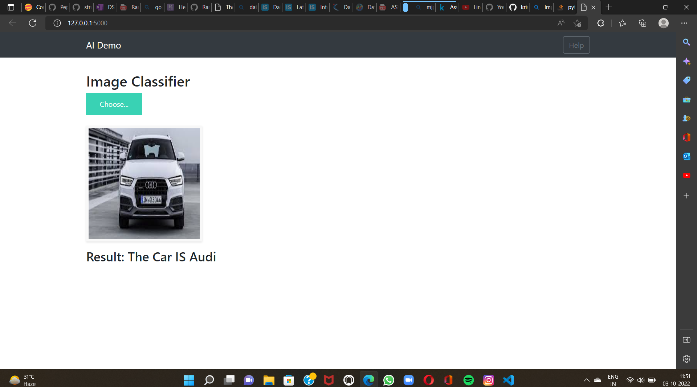
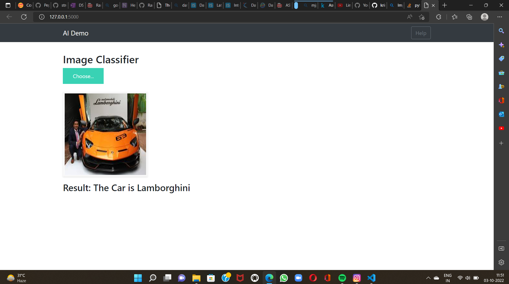
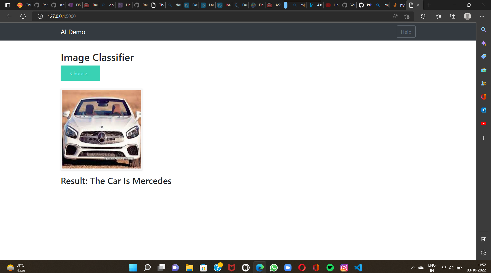

# Deep-Learning-Car-Brand
this readme file contains projects and learning material.

# Requirments :
* Install Python 3.7.6
    * Install using link :
        * For Window user : https://www.python.org/ftp/python/3.7.6/python-3.7.6-amd64.exe
        * For Mac User  : https://www.python.org/ftp/python/3.7.6/python-3.7.6-macosx10.9.pkg
* Install Jupyter Notebook
    * Run this Command in Command prompt :
        * pip install jupyter notebook
* Install Mediapipe
    * Run the following command in jupyter notebook cell
         * !pip install mediapipe --user
* install pydirectinput (for Hill Climb and temple run automation)
    * Run the command in jupyter notebook cell :
         * !pip install pydirectinput

         

**-----------------------------------------------------------------------------------------------------------------**
  

* # [Car Brand Detection : ](https://github.com/Aswanurrehman/DL_Car_Brand_Classification

    
**some output pics**

Audi Detection
  

  

Lamborghini
  

  
    
Mercedes

  

  